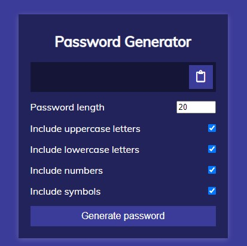
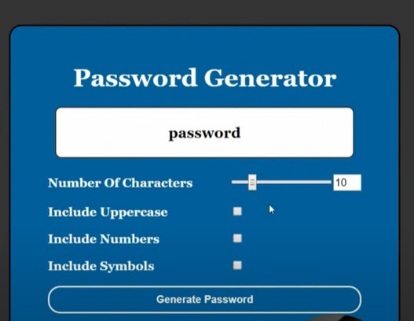

# Password Generator

A customizable password generator built with HTML, CSS, and JavaScript that creates secure, randomized passwords and is packaged as a Chrome extension for quick access directly in the browser.

## About

This project began as an extra-credit assignment during the PERSEVERE Full MERN Stack Software Development Bootcamp. After completing the bootcamp, I revisited the project and expanded it into a Chrome extension with additional features, improved validation, and a stronger user experience.

## Live Demo

🔐 **Try it here:**

https://graceelliott8374-tech.github.io/password-generator/

## Features

- Generate randomized passwords
- Choose a password length from 8 to 124 characters
- Include uppercase letters
- Include lowercase letters
- Include numbers
- Include symbols
- Password strength feedback
- Show or hide the generated password
- Copy the password to the clipboard
- Regenerate a password using the same settings
- Input validation
- Chrome extension support using Manifest V3

## Built With

- HTML5
- CSS3
- JavaScript
- Chrome Extension Manifest V3

## What I Learned

This project strengthened my understanding of:

- JavaScript functions
- DOM manipulation
- Random number generation
- Input validation
- Event listeners
- Browser APIs
- Password-strength evaluation
- Chrome extension structure
- Organizing project files with reusable asset folders

## Project Evolution

### Original Version

The original password generator was completed as an extra-credit bootcamp assignment.

### Current Version

After completing the bootcamp, I returned to the project and added:

- Chrome extension functionality
- Password strength feedback
- Copy-to-clipboard support
- Show and hide controls
- Improved validation
- Responsive styling
- Regeneration animation

## Assignment Results

The original project earned a **102% final grade**.

Instructor feedback:

> Very nice work on this one. The only thing missing was the error handling to let the user know they need to choose within the choices set by the application. Overall, good job!

The current version addresses that feedback by displaying validation messages when the user does not select a character type or enters an invalid password length.

## Screenshots

### Password Generator



### Generated Password and Strength Feedback



## Install as a Chrome Extension

1. Download or clone this repository.
2. Open Chrome.
3. Navigate to:

```text
chrome://extensions/
```

4. Turn on **Developer mode**.
5. Click **Load unpacked**.
6. Select the project folder.
7. Pin the extension to the Chrome toolbar for quick access.

## Run Locally

Clone the repository:

```bash
git clone https://github.com/graceelliott8374-tech/password-generator.git
```

Open `index.html` in your browser.

## Project Structure

```text
password-generator/
├── assets/
│   ├── images/
│   │   ├── password-ex-1.jpg
│   │   └── password-ex-2.jpg
│   ├── script/
│   │   └── script.js
│   └── style/
│       └── style.css
├── icon.png
├── index.html
├── manifest.json
└── README.md
```

## Future Improvements

- Passphrase generation
- Password history
- Additional strength calculations
- Theme options
- Firefox extension support
- Edge extension support
- Improved accessibility

## License

This project is available for educational and portfolio purposes.
